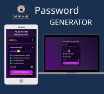

<h1 align="center">Password Generator App</h1>

  

## About

The Password Generator web application is a practical tool designed to create secure and customizable passwords. It provides users with the ability to generate passwords of varying lengths and complexity, with options to include uppercase letters, lowercase letters, numbers, and symbols. The application is built using HTML, CSS, and JavaScript and offers a user-friendly interface for generating and copying passwords.

## Key Features

1. **Password Length Selection:** Users can choose the desired length of their password using a slider. The current password length is displayed dynamically.

2. **Character Options:** Users can choose uppercase letters, lowercase letters, numbers, and symbols to customize their passwords.

3. **Password Strength Indicator:** The application provides a visual indicator showing whether the generated password is weak, moderate, or strong.

4. **Password Display:** The generated password is displayed in a read-only input field for easy viewing and copying.

5. **Copy to Clipboard:** Users can copy the generated password to their clipboard with a single click.

## How to Use

1. **Password Length:** Adjust the password length using the slider.

2. **Character Options:** Select the character types you want to include.

3. **Generate Password:** Click the **Generate Password** button.

4. **Copy Password:** Click the **Copy** button to copy the generated password.

## Strength and Security

A strong password should have sufficient length and a varied character set. This application allows users to customize password length and character types according to their security requirements.